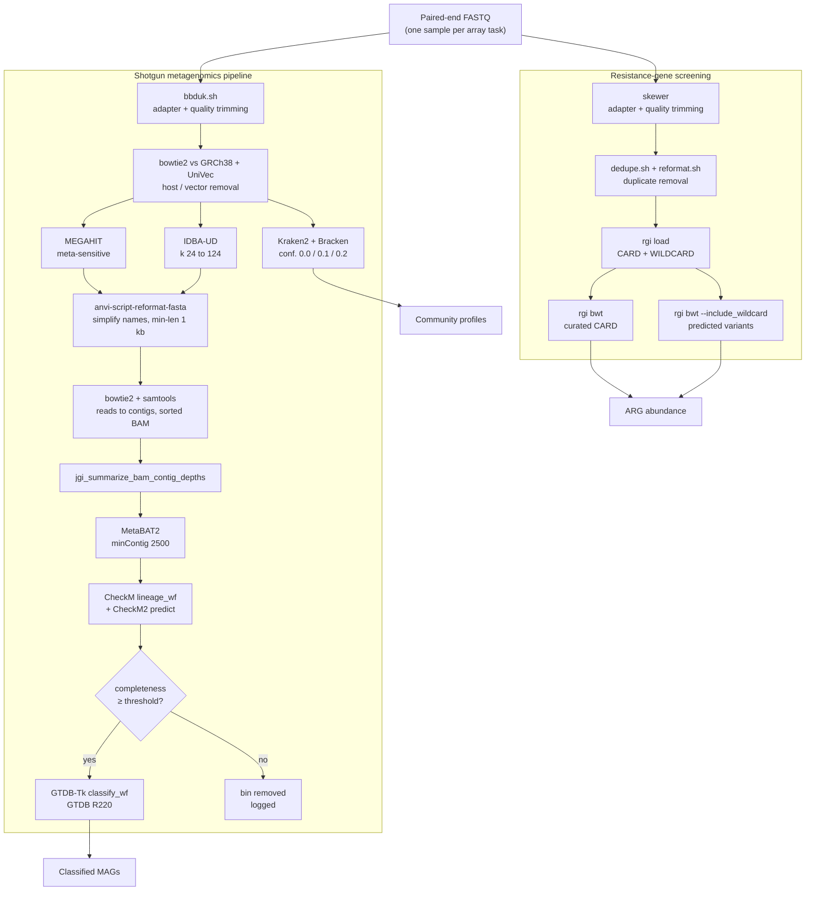

# hpc-metagenomics-workflow

Two containerised SLURM workflows for metagenomic analysis of wastewater
samples, developed for on-site wastewater treatment systems (OWTS) and run as
job arrays on an HPC cluster. Every tool is invoked through a Singularity
container; every container has a build recipe in this repository.

- **`workflows/metagenomics_wgs_pipeline.sbatch`** — general-purpose shotgun
  metagenomics: quality control through to taxonomically classified MAGs.
- **`workflows/rgi_card_screening.sbatch`** — targeted screening for
  antibiotic-resistance genes with RGI against the CARD database.

Both are launched the same way, through `bin/submit_pipeline.sh`, which sizes
the SLURM array from the input directory.

> **Note on data.** The sequencing data these pipelines were built for is
> unpublished and is not included. `example_data/` contains empty placeholder
> files that document the expected input layout. Reference databases are not
> bundled either — see [`docs/databases.md`](docs/databases.md).

---

## The two workflows

### 1. Shotgun metagenomics — `metagenomics_wgs_pipeline.sbatch`

Assembly-first. Takes raw paired-end reads and produces taxonomic profiles,
metagenome assemblies, and quality-controlled, taxonomically classified MAGs.

| Stage | Tool | Output |
|---|---|---|
| Adapter & quality trimming | BBTools `bbduk.sh` | trimmed FASTQ |
| Host / vector decontamination | `bowtie2` vs GRCh38 + UniVec | decontaminated FASTQ |
| Read-level taxonomic profiling | Kraken2 + Bracken, at three confidence levels | per-sample abundance reports |
| Assembly, branch A | MEGAHIT (`--presets meta-sensitive`) | contigs ≥ 1 kb |
| Assembly, branch B | IDBA-UD (k 24→124) | contigs ≥ 1 kb |
| Contig renaming | anvi'o `anvi-script-reformat-fasta` | short, unique, sample-prefixed contig names |
| Coverage | `bowtie2` + `samtools` | sorted, indexed BAM |
| Binning | MetaBAT2 (`--minContig 2500`) | draft MAGs |
| Bin QC | CheckM `lineage_wf` **and** CheckM2 `predict` | completeness / contamination |
| Bin filtering | completeness threshold from CheckM2 | low-quality bins dropped, logged |
| MAG taxonomy | GTDB-Tk `classify_wf` (GTDB R220) | GTDB taxonomy per MAG |

Two assemblers run per sample by design: MEGAHIT and IDBA-UD recover different
parts of a complex community, and comparing their binning outcomes is a check on
assembly-driven artefacts rather than duplicated effort.

Both CheckM1 and CheckM2 run on every bin set: CheckM1 places bins in a
reference tree and scores lineage-specific markers, CheckM2 uses a machine
learning predictor that handles poorly represented lineages better. On
wastewater — which is full of organisms with few reference genomes — they
disagree, and the disagreement is informative. Only CheckM2's completeness
drives the automated bin-dropping filter.

### 2. Resistance-gene screening — `rgi_card_screening.sbatch`

Read-based and reference-driven. Same sample type, different question.

| Stage | Tool | Output |
|---|---|---|
| Adapter & quality trimming | `skewer` (paired, separate R1/R2 adapters) | trimmed FASTQ |
| Duplicate removal | BBTools `dedupe.sh` | deduplicated interleaved FASTQ |
| Re-pairing | BBTools `reformat.sh` | deduplicated R1/R2 |
| Reference load | `rgi load` (CARD + WILDCARD) | per-task RGI database |
| ARG quantification, curated | `rgi bwt` vs CARD | per-gene read counts |
| ARG quantification, predicted | `rgi bwt --include_wildcard` | counts including WILDCARD variants |

### How they complement each other

They answer different questions and fail in different places, which is why both
exist rather than the ARG step being folded into the general pipeline:

| | Shotgun pipeline | RGI screening |
|---|---|---|
| **Question** | Who is here, and what are their genomes? | Which resistance determinants are present, and at what abundance? |
| **Approach** | Assemble, then bin, then classify | Map reads directly to a curated reference |
| **Depends on assembly?** | Yes — a poorly assembling sample yields few MAGs | No — works on reads, so low-biomass or high-diversity samples still give results |
| **Sensitivity to rare genes** | Low — a resistance gene on a low-coverage contig may not assemble or bin | High — a handful of reads is detectable |
| **Attribution** | Strong — a gene in a MAG has a host | Weak — read-level hits are not linked to an organism |
| **Runtime** | Hours to a day per sample, 60 cores | Under an hour per sample, 20 cores |
| **Deduplication** | Not applied (would distort assembly coverage) | Applied (PCR duplicates inflate ARG abundance) |

Read together, the shotgun pipeline says *who is present* and the RGI workflow
says *what resistance is present and how much*. The obvious follow-up — which
MAG carries which ARG — needs a third step (running `rgi main` on the MAG
contigs) that is not part of either workflow.

Note the deliberate difference in duplicate handling: RGI deduplicates because
PCR duplicates directly bias abundance estimates, while the shotgun pipeline
does not, because assemblers use coverage depth and removing duplicates
distorts it.

---

## Workflow diagram



Everything inside each subgraph runs within a single array task, for a single
sample. The two workflows are submitted as separate job arrays.

---

## Launching a run

`#SBATCH` directives are read by `sbatch` **at submission time**, from the top
of the file, before any of the script body executes. A job script therefore
cannot compute its own `--array` bound — by the time it could count the input
files, the array has already been sized. That is why the original scripts
carried a hand-edited `#SBATCH --array=0-4`.

`bin/submit_pipeline.sh` resolves this by passing `--array` on the `sbatch`
command line, where it overrides the directive in the file. The job script stays
immutable and version-controlled.

### Standard launch pattern

```bash
# 1. Copy a config and edit the paths in it
cp config/wgs_pipeline.config.sh config/my_run.config.sh
$EDITOR config/my_run.config.sh

# 2. Check what would be submitted, without submitting
bin/submit_pipeline.sh --dry-run config/my_run.config.sh \
                       workflows/metagenomics_wgs_pipeline.sbatch

# 3. Submit
bin/submit_pipeline.sh config/my_run.config.sh \
                       workflows/metagenomics_wgs_pipeline.sbatch
```

Same for the other workflow:

```bash
bin/submit_pipeline.sh config/rgi_pipeline.config.sh \
                       workflows/rgi_card_screening.sbatch
```

Any extra arguments are passed straight through to `sbatch`:

```bash
bin/submit_pipeline.sh config/my_run.config.sh \
                       workflows/metagenomics_wgs_pipeline.sbatch \
                       --hold --dependency=afterok:12345
```

### What the launcher does

1. Sources the config.
2. Runs `bin/build_sample_manifest.sh` to write `samples.tsv` — one row per
   sample, `sample<TAB>R1 path<TAB>R2 path` — and fails loudly if a mate file is
   missing or empty.
3. Snapshots the config next to the manifest, so the run stays reproducible even
   if the config is edited afterwards.
4. Submits with `--array=0-$((N-1))`, optionally throttled with `%N`.
5. Passes the manifest path to the job via `--export`.

Array task *i* reads line *i+1* of the manifest. Sizing the array and selecting
the sample from the same fixed file means they cannot disagree — the original
re-globbed the input directory inside every task, so a file appearing or
disappearing mid-run would shift every sample onto a different index.

A run directory looks like this:

```
runs/metagenomics_wgs_pipeline_20260809T142530/
├── samples.tsv               # what this job ID processed
├── config.snapshot.sh        # the config as it was at submission
├── slurm-1234567_0.out       # one log per array task
├── slurm-1234567_1.out
├── lowqual_bins_removed.log
└── work/                     # per-sample intermediates
    ├── OWTS_01/
    └── OWTS_02/
```

### Alternatives considered

- **Rewriting the `#SBATCH --array` line in place before each run.** Works, but
  it makes the job script a generated artefact — the file in git is never the
  file that ran.
- **A single job that internally loops over samples.** Gives up all the array
  benefits: no per-sample scheduling, no per-sample restart, no `%` throttle.
- **`--array=0-999` with tasks exiting early when past the end of the list.**
  Wasteful of scheduler slots and noisy in `sacct`.

Passing `--array` on the command line is the idiomatic SLURM answer, and it is
what the launcher does.

---

## Sample naming

Neither pipeline assumes a fixed naming scheme. Sample names are derived
according to the config:

```bash
FASTQ_GLOB="*_R1_merged.fastq"     # matches exactly one file per sample
SAMPLE_NAME_MODE="strip_suffix"    # or "cut_fields"
R1_SUFFIX="_R1_merged.fastq"
R2_SUFFIX="_R2_merged.fastq"
```

**`strip_suffix`** (default, recommended) — the sample name is the filename with
`R1_SUFFIX` removed. It works for any scheme, including names containing an
arbitrary number of underscores:

```
Site-A_2024-03-11_run7_S12_L002_R1_001.fastq.gz
→ Site-A_2024-03-11_run7_S12_L002
```

**`cut_fields`** — the sample name is the first `SAMPLE_NAME_FIELDS` fields,
split on `SAMPLE_DELIM`. This reproduces the original scripts' behaviour
(`cut -d '_' -f-2` in the shotgun pipeline, `cut -d '_' -f -4` in the RGI one)
for datasets already named that way.

The shotgun pipeline additionally uses a **short identifier** to prefix renamed
contigs and to name BAM and bin files. `SAMPLE_ID_FIELD` controls it: empty (the
default) uses the whole sample name; an integer *N* uses field *N*. The original
hardcoded `cut -d '_' -f2`.

`FASTQ_GLOB` deliberately anchors on the R1 suffix rather than matching
`*.fastq`. See [known issue F4](docs/known_issues.md#f4--the-sample-list-was-built-from-a-glob-that-matched-the-pipelines-own-output).

See [`example_data/README.md`](example_data/README.md) for worked examples.

---

## Repository layout

```
hpc-metagenomics-workflow/
├── README.md
├── LICENSE
├── .gitignore
│
├── bin/
│   ├── submit_pipeline.sh            # launcher: computes --array, submits
│   └── build_sample_manifest.sh      # FASTQ directory -> samples.tsv
│
├── config/
│   ├── wgs_pipeline.config.sh        # all paths and parameters, shotgun
│   └── rgi_pipeline.config.sh        # all paths and parameters, RGI
│
├── workflows/
│   ├── metagenomics_wgs_pipeline.sbatch
│   └── rgi_card_screening.sbatch
│
├── build_singularity_containers/
│   ├── README.md                     # build instructions, confidence table
│   ├── bbtools.def
│   ├── datascience_genomics.def      # bowtie2, samtools, megahit
│   ├── kraken2_bracken.def
│   ├── idba_ud.def
│   ├── anvio-8.def
│   ├── metabat2.def
│   ├── checkm.def                    # reconstruction — see recipe header
│   ├── checkm2.def
│   ├── gtdbtk.def
│   ├── skewer.def
│   └── card_rgi.def
│
├── docs/
│   ├── databases.md                  # every external DB: what, how big, where
│   └── known_issues.md               # defects found in the original scripts
│
└── example_data/
    ├── README.md
    ├── wgs_input/                    # empty placeholders, shotgun naming
    └── rgi_input/                    # empty placeholders, RGI naming
```

Configuration is kept entirely out of the job scripts: every site-specific path,
resource request and analysis parameter lives in `config/`, and the same file is
read by both the launcher and the job. That is what makes the array bound and
the array tasks provably consistent, and it means running on a different cluster
is a config edit rather than a script edit.

---

## Prerequisites

- **SLURM** with job array support.
- **Singularity / Apptainer** ≥ 3.7, available as an environment module
  (`SINGULARITY_MODULE` in the config; set to `apptainer` if that is what your
  site provides).
- **Bash 4.3+** on the login and compute nodes (`mapfile`, associative arrays).
- The container images, built from `build_singularity_containers/`.
- The reference databases in [`docs/databases.md`](docs/databases.md) —
  roughly 190 GB in total, dominated by GTDB-Tk and Kraken2 `pluspf`.
- Enough scratch for intermediates: budget ~5× the raw FASTQ size per sample for
  the shotgun pipeline (two assemblies, two BAMs, bins), ~2× for RGI.

Indicative resources per array task, from the original job scripts:

| | Shotgun | RGI |
|---|---|---|
| CPUs | 60 | 20 |
| Memory | 120 GB | 2 GB/CPU (40 GB) |
| Walltime | see [N1](docs/known_issues.md#n1--the-walltime-is-almost-certainly-too-short) | 1.5 h |

---

## Known issues in the original scripts

The scripts here are a cleaned-up version of working code. Several genuine
defects were found while generalising them; they are documented rather than
silently patched, in [`docs/known_issues.md`](docs/known_issues.md). The most
consequential:

- **[F1](docs/known_issues.md)** — `GTDBTk_classify_wf` referenced an undefined
  `$bins_path`, which clobbered the global `contig_size` and mislabelled every
  GTDB-Tk output.
- **[F2](docs/known_issues.md)** — `GTDBTK_DATA_PATH` was never set, so GTDB-Tk
  was never told where its reference data lives.
- **[F4](docs/known_issues.md)** — the sample list was globbed from a directory
  the pipeline also writes into, so re-runs could shift samples onto the wrong
  array index.
- **[F5](docs/known_issues.md)** — `xargs rm` with empty input failed the job
  precisely when every bin passed QC.
- **[N1](docs/known_issues.md), [N2](docs/known_issues.md)** — a 3-hour walltime
  for a task that runs two assemblers plus GTDB-Tk, and
  `--pplacer_threads 60` against a 120 GB allocation.

---

## License

[MIT](LICENSE).

For a portfolio repository of pipeline code, MIT is the right default: it is
short enough that a reader actually reads it, it is the most widely recognised
permissive licence, and it imposes no obligations on anyone reusing a snippet of
the workflow. Apache-2.0 would be the alternative — it adds an explicit patent
grant and a requirement to state changes, which matter for a library that
downstream projects depend on, but add ceremony without benefit here. Neither
licence affects the tools these workflows call: those keep their own licences
(GPL, MIT and others), and the container recipes only install them.
